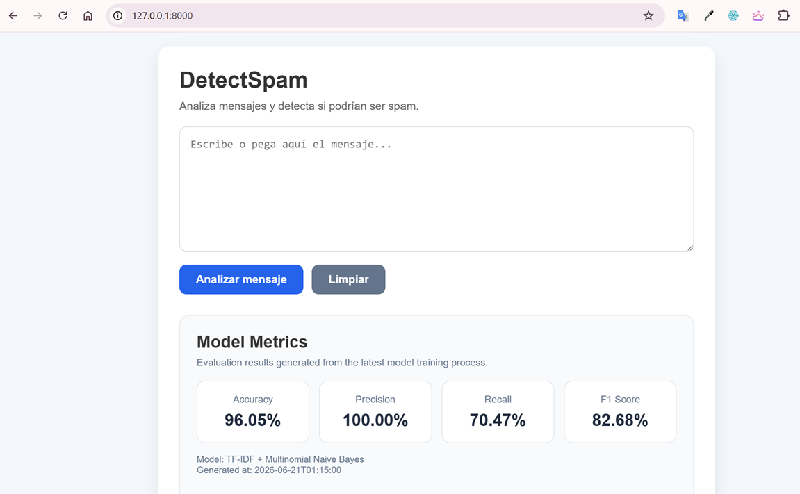
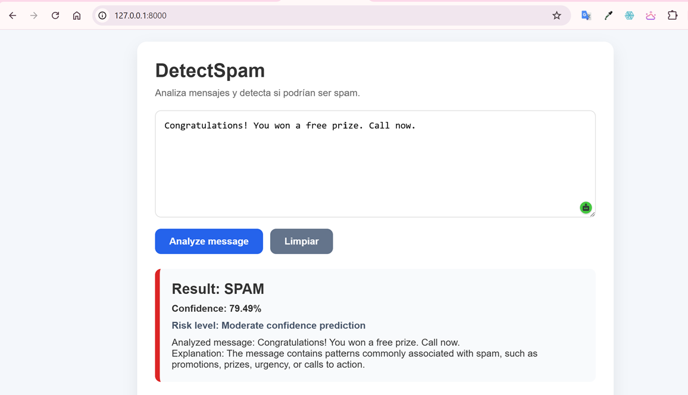
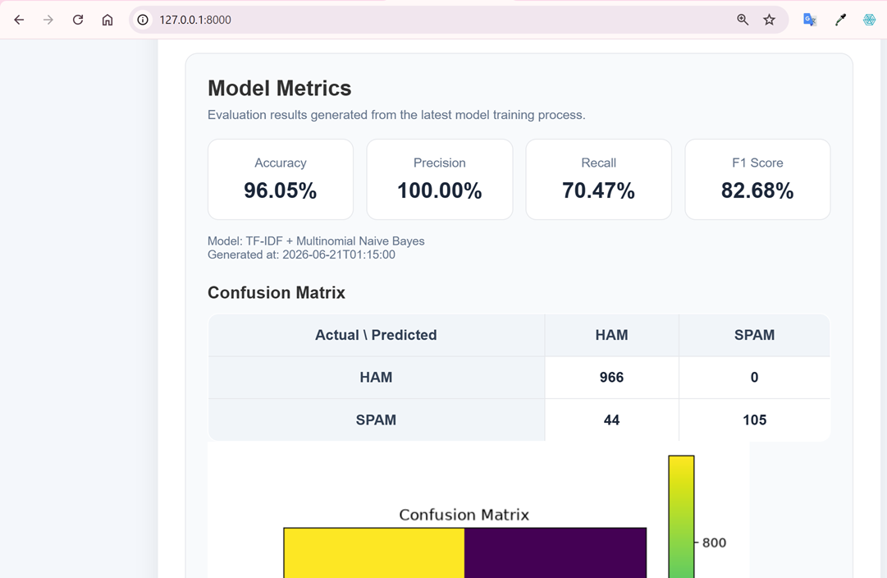
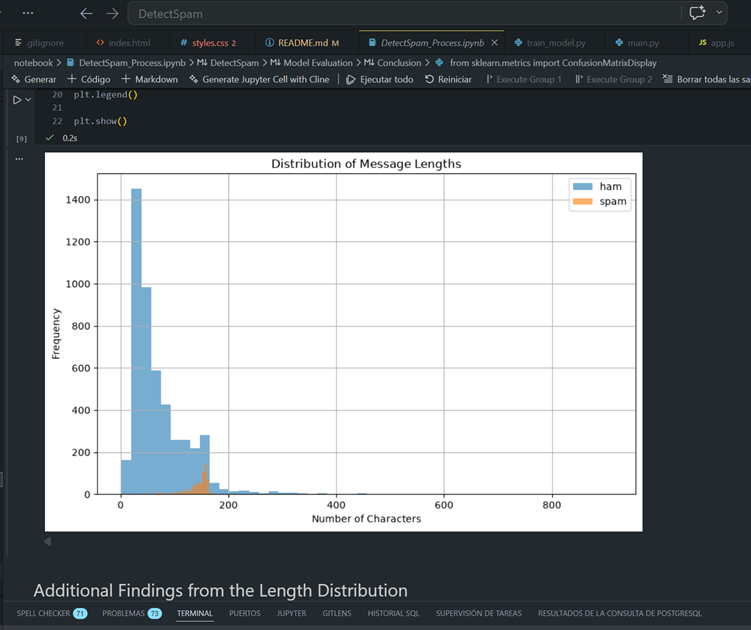

# DetectSpam

## Spam Message Detection using Machine Learning

DetectSpam is a web application that uses Natural Language Processing (NLP) and Machine Learning techniques to classify text messages as **SPAM** or **HAM (Not Spam)**.

The project combines a complete Data Science workflow, a Machine Learning model, a REST API built with FastAPI, and a web interface developed using HTML, CSS, and JavaScript.

---

# Academic Context

This project was developed as part of the **Master's Degree in Artificial Intelligence** at **Universidad Icesi**, within the course:

**Hackeando la IA**

Course Instructor:

**Professor Christian Urcuqui**

Year:

**2026**

---

# Project Team

* Alfredo Aponte
* Arlex Pino

---

# Project Objectives

The primary objective of this project is to design, implement, and evaluate a Machine Learning-based spam detection system capable of automatically classifying SMS messages.

The project applies the complete Data Science lifecycle, including:

* Data acquisition
* Exploratory Data Analysis (EDA)
* Text preprocessing
* Feature engineering
* Model training
* Model evaluation
* Deployment through a web application

---

# Solution Architecture

The solution consists of four main components.

## Data Layer

Datasets used for training and experimentation:

* SMS Spam Collection Dataset
* Spambase Dataset

## Machine Learning Layer

* Text Preprocessing
* TF-IDF Vectorization
* Multinomial Naive Bayes Classifier
* Metrics Generation
* Model Persistence
* Metrics Persistence
* Confusion Matrix Generation

## Backend Layer

* FastAPI
* REST API Endpoints
* Prediction Service
* Metrics Service

## Frontend Layer

* HTML5
* CSS3
* JavaScript
* Metrics Dashboard
* Confusion Matrix Visualization
* Confidence-Based Risk Indicator

---

# Application Screenshots

The following screenshots illustrate the main components of the DetectSpam solution, including the user interface, prediction workflow, model monitoring dashboard, and exploratory data analysis process.

## Home Page

Main interface of the DetectSpam application, including the message input area, prediction controls, and model monitoring dashboard.



---

## Prediction Example

Example of a spam message classification showing the predicted label, confidence score, explanation, and confidence-based risk indicator.



---

## Metrics Dashboard

Real-time monitoring dashboard displaying model evaluation metrics, confusion matrix values, heatmap visualization, and model information.



---

## Exploratory Data Analysis (EDA)

Example of the exploratory analysis performed during the Data Science process and documented in the project notebook.



---

# Repository Structure

```text
DetectSpam/
│
├── app/
│   ├── __init__.py
│   ├── main.py
│   ├── schemas.py
│   │
│   ├── services/
│   │   ├── predictor.py
│   │   └── metrics.py
│   │
│   ├── ml/
│   │   ├── __init__.py
│   │   ├── preprocessing.py
│   │   ├── train_model.py
│   │   └── models/
│   │       ├── metrics.json
│   │       ├── confusion_matrix.png (generated)
│   │       └── spam_model.joblib (generated)
│   │
│   ├── templates/
│   └── static/
│
├── data/
│   ├── smsspam/
│   └── spambase/
│
├── notebook/
│   └── DetectSpam_Process.ipynb
│
├── requirements.txt
├── README.md
└── .gitignore
```

---

# Datasets

## SMS Spam Collection Dataset

Primary dataset used for training.

Characteristics:

* 5,574 SMS messages
* Binary classification:

  * ham
  * spam

Source:

https://archive.ics.uci.edu/dataset/228/sms+spam+collection

---

## Spambase Dataset

Secondary dataset included for future experimentation and comparative analysis.

Characteristics:

* 4,601 email messages
* 57 numerical features
* Binary spam classification

Source:

https://archive.ics.uci.edu/dataset/94/spambase

---

# Data Science Notebook

The complete Data Science process is documented in:

```text
notebook/DetectSpam_Process.ipynb
```

The notebook includes:

* Data loading
* Exploratory Data Analysis (EDA)
* Class distribution analysis
* Message length analysis
* Frequent word analysis
* Text preprocessing
* TF-IDF feature engineering
* Train/Test split
* Model training
* Model evaluation
* Confusion matrix analysis
* Classification report
* Prediction examples
* Conclusions
* Future work

---

# Technologies

## Backend

* Python 3.11
* FastAPI
* Uvicorn

## Machine Learning

* Scikit-Learn
* Pandas
* NumPy
* Joblib

## Data Science

* Jupyter Notebook
* Matplotlib

## Frontend

* HTML5
* CSS3
* JavaScript

---

# Installation

## Create Virtual Environment

```bash
python -m venv .venv
```

## Activate Environment

Windows:

```bash
.venv\Scripts\activate
```

Linux / macOS:

```bash
source .venv/bin/activate
```

## Install Dependencies

```bash
pip install -r requirements.txt
```

---

# Training the Model

```bash
python -m app.ml.train_model
```

The training process generates the following artifacts:

```text
app/ml/models/spam_model.joblib
app/ml/models/metrics.json
app/ml/models/confusion_matrix.png
```

The generated metrics file contains:

* Accuracy
* Precision
* Recall
* F1 Score
* Confusion Matrix values
* Generation Timestamp

The confusion matrix image is automatically generated during model training and is displayed by the web dashboard for model performance analysis.

### Version Control Notes

* `metrics.json` is versioned in Git to preserve reproducible evaluation results.
* `spam_model.joblib` is excluded from version control because it can be regenerated by retraining the model.
* `confusion_matrix.png` is excluded from version control because it is automatically generated during training.

---

# Running the Application

```bash
uvicorn app.main:app --reload
```

Application URL:

```text
http://127.0.0.1:8000
```

Swagger Documentation:

```text
http://127.0.0.1:8000/docs
```

---

# API Endpoints

| Method | Endpoint | Description              |
| ------ | -------- | ------------------------ |
| GET    | /        | Web interface            |
| GET    | /health  | Health check             |
| GET    | /metrics | Model evaluation metrics |
| POST   | /predict | Spam prediction          |

---

# Model Performance

Model:

* TF-IDF Vectorizer
* Multinomial Naive Bayes

Evaluation Results:

| Metric    | Value   |
| --------- | ------- |
| Accuracy  | 96.05%  |
| Precision | 100.00% |
| Recall    | 70.47%  |
| F1 Score  | 82.68%  |

---

# Confusion Matrix

| Actual / Predicted | Ham | Spam |
| ------------------ | --- | ---- |
| Ham                | 966 | 0    |
| Spam               | 44  | 105  |

Observations:

* No false positives were generated.
* The classifier is highly conservative when labeling spam messages.
* Some spam messages remain undetected, impacting recall.

---

# Metrics Dashboard

The web interface includes a real-time model monitoring dashboard displaying:

* Accuracy
* Precision
* Recall
* F1 Score
* Confusion Matrix values
* Confusion Matrix heatmap visualization
* Model information
* Metrics generation timestamp

Metrics are loaded dynamically from the `/metrics` endpoint and always reflect the latest model training execution.

The confusion matrix visualization is generated automatically during model training and displayed directly within the web interface to facilitate model performance analysis.

---

# Example Prediction Workflow

```text
User Message
      ↓
Text Preprocessing
      ↓
TF-IDF Vectorization
      ↓
Multinomial Naive Bayes
      ↓
Prediction (HAM/SPAM)
      ↓
Confidence Score
      ↓
Risk Indicator
```

---

# Future Work

Potential future improvements include:

* Improving recall while preserving high precision.
* Evaluating Logistic Regression and Random Forest models.
* Experimenting with Deep Learning and Transformer-based approaches.
* Implementing Explainable AI (XAI) techniques.
* Supporting model versioning.
* Implementing automatic retraining pipelines.
* Supporting multilingual spam detection.
* Exploring adversarial spam detection scenarios.

---

# License

This repository was developed exclusively for educational and academic purposes.

Universidad Icesi

Master's Degree in Artificial Intelligence

Hackeando la IA

2026
